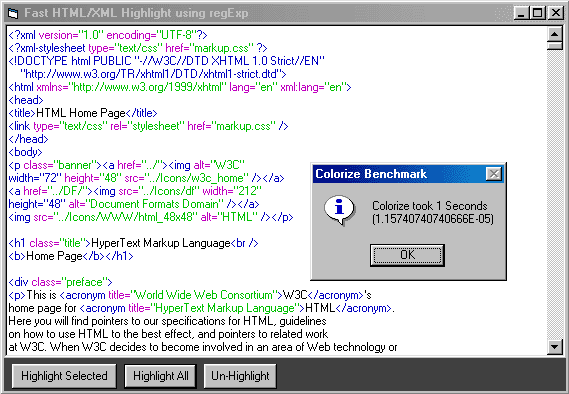



## FastHTML/XML Highlight

### Description

Highlights HTML and XML properly

You can Highlight all text or just selected text and highlights syntax as you type.

Will parse standard size files 10-60k instantly

500k files in about 6 seconds.

Now you can easily change the colors thanks to

M.Bartlema

A much faster version is on the way!

By the way, If you are wondering why this highlighter is so much faster and supports syntax better than most post here the answer is Regular Expressions. M.Bartlema was able to speed his code up 3 times by replacing a single VBReplace with a regExp. His code is currently faster than mine by the way.

We hope to post a regExp tutorial in the near future that will blow your minds in two ways.

1. A single regExp can replace a lot of code

2. They scream!!!

A small example? ok this regEx replace highlights all HTML tags one color.

tmpstr = ReplaceText("(<[^>]+>)", "\plain\f2\fs17\cf1 $1\plain\f2\fs17\cf0 ", tmpstr)

Of course this assumes that you have a color table in the rtf with 2 colors.

Any other way is a waste of time - literally!
 
### More Info
 
' Needs reference to Microsoft VBscript Regular Expressions.

' Get it at http://msdn.microsoft.com/downloads/default.asp?URL=/downloads/sample.asp?url=/msdn-files/027/001/733/msdncompositedoc.xml

astonishment, amazement, and an uncontrollable urge to learn Regular Expressions in VB.

             |
---                |---
**Submitted On**   |2001-11-01 05:18:50
**By**             |[RegX](https://github.com/Planet-Source-Code/PSCIndex/blob/master/ByAuthor/regx.md)
**Level**          |Advanced
**User Rating**    |5.0 (35 globes from 7 users)
**Compatibility**  |VB 6\.0
**Category**       |[Internet/ HTML](https://github.com/Planet-Source-Code/PSCIndex/blob/master/ByCategory/internet-html__1-34.md)
**World**          |[Visual Basic](https://github.com/Planet-Source-Code/PSCIndex/blob/master/ByWorld/visual-basic.md)
**Archive File**   |[FastHTML\_X325111112001\.zip](https://github.com/Planet-Source-Code/regx-fasthtml-xml-highlight__1-28566/archive/master.zip)

